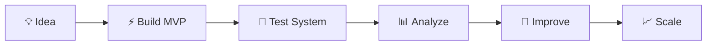

<div align="center">

# ⚡ Muhammed Salman N

### AI Engineer • Full Stack Developer • Systems Architect • Startup Builder


<br>


</div>

---

<p align="center">
  
</p>

---

# 🧠 About Me

```yaml
Name: Muhammed Salman N

Role:
  - AI & Data Science Student
  - Full Stack Developer
  - Systems Builder

Focus:
  - Backend Engineering
  - AI Integration
  - Scalable System Design
  - Startup Product Development

Current Mission:
  Building practical systems that solve real-world problems
  through intelligent software engineering and automation.

Primary Stack:
  - Python
  - React.js
  - Node.js
  - Django
  - Flask

Learning Philosophy:
  Learn by building.
  Build by solving.
  Scale by iterating.

Current Status:
  Designing scalable systems and experimenting
  with AI-powered applications.
```

---

# 🚀 Developer Philosophy

<div align="center">

| Principle | Meaning |
|---|---|
| ⚡ Build Fast | Ship ideas rapidly and validate quickly |
| 🧠 Learn Continuously | Improve through execution and iteration |
| 🏗️ Think in Systems | Focus on scalable architectures |
| 🚀 Scale Smart | Optimize before expanding |
| 💡 Solve Real Problems | Build products with practical impact |

</div>

---

# 🔥 Current Focus Areas

```text
✔ Full Stack Development
✔ AI-Powered Systems
✔ Backend Engineering
✔ API Development
✔ Startup Product Building
✔ Workflow Automation
✔ System Design
✔ Problem Solving Through Software
```

---

# 🛠️ Tech Ecosystem

<div align="center">


</div>

---

# ⚛ Frontend Development

```text
• React.js
• Modern Responsive UI
• Component-Based Architecture
• Frontend State Management
• Dynamic User Interfaces
• SPA Development
```

---

# 🟢 Backend Engineering

```text
• Node.js APIs
• Flask Systems
• Django Architectures
• REST API Design
• Authentication Systems
• Scalable Backend Logic
```

---

# 🧠 AI & Data Science

```text
• AI System Integration
• Intelligent Workflows
• Data Processing
• Automation Systems
• Applied Machine Learning
• Analytical Thinking
```

---

# 🏗️ System Design

```text
• Scalable Architectures
• Workflow Automation
• Database Design
• Backend Optimization
• Modular Development
• Product-Oriented Engineering
```

---

# 🚀 Featured Projects

---

## ♻️ GreenCycle Nexus

### Smart Waste Management & Civic Automation Platform

<p align="center">
  <a href="https://github.com/mav8stro/Greencycle-Nexus">
    
  </a>
</p>

```text
A modern civic infrastructure platform designed
to automate waste collection workflows,
approval systems, and operational analytics.

Tech Stack:
• Flask
• SQLite
• JavaScript
• HTML/CSS

Key Features:
✔ Multi-role architecture
✔ Waste workflow automation
✔ Payment tracking
✔ Pickup scheduling
✔ Dashboard analytics
```

---

## 🤝 Volunteer Management Platform

<p align="center">
  <a href="https://github.com/mav8stro/volunteer_app">
    
  </a>
</p>

```text
A volunteer coordination and management platform
focused on workflow organization and scalable
community operations.

Features:
✔ Volunteer registration
✔ Event coordination
✔ Role management
✔ Activity tracking
✔ Scalable workflow system
```

---

# 📊 Development Workflow

<div align="center">



</div>

---

# 🌐 Professional Network

<div align="center">

<a href="https://github.com/mav8stro">
  
</a>

<a href="https://dev.to/mav8stro">
  
</a>

<a href="https://www.linkedin.com/in/muhammed-salman-n-337400364">
  
</a>

<a href="https://kaggle.com/muhammedsalmanadnani">
  
</a>

<a href="https://medium.com/@muhammedsalmanbinnoor">
  
</a>

<a href="https://www.behance.net/muhammedsalman51">
  
</a>

<a href="https://codeforces.com/profile/darkjokerjr">
  
</a>

<a href="https://instagram.com/sal_mx.x_">
  
</a>

<a href="https://discord.com/users/1416840105812824114">
  
</a>

</div>

---

# 📈 GitHub Analytics

<div align="center">


</div>

---

# 🔥 Contribution Streak

<div align="center">


</div>

---

# 📊 Contribution Graph

<div align="center">


</div>

---

# 🎯 Current Goals

```text
🚀 Build scalable full stack systems
🧠 Improve AI engineering skills
⚡ Master backend architecture
🌍 Create impactful real-world products
📈 Grow as a startup-focused developer
🏗️ Build production-ready applications
```

---

# 📫 Resume & Contact

<div align="center">

<a href="https://drive.google.com/file/d/1qsi0W9mr8O9bUbd_f8UI-i3bgVFZXcDg/view">
  
</a>

<br><br>


</div>

---

# ⚡ Final Note

<div align="center">


</div>

---

<div align="center">


</div>
