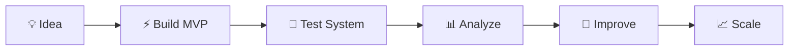

````md
<div align="center">

# ⚡ MUHAMMED SALMAN N

### AI Engineer • Full Stack Developer • Systems Architect • Startup Builder


<br>


<br><br>


</div>

---

<p align="center">
  
</p>

---

# 🧠 About Me

```yaml
Name: Muhammed Salman N

Roles:
  - AI & Data Science Student
  - Full Stack Developer
  - Systems Architect
  - Startup-Focused Builder

Specialization:
  - Backend Engineering
  - AI Integration
  - Scalable Architectures
  - Workflow Automation
  - Product Development

Mission:
  Building practical real-world systems
  through scalable software engineering
  and intelligent automation.

Core Stack:
  - Python
  - React.js
  - Node.js
  - Django
  - Flask
  - PostgreSQL

Philosophy:
  Learn by building.
  Build by solving.
  Scale through iteration.
````

---

# ⚡ Developer Mindset

<div align="center">

| Principle              | Focus                        |
| ---------------------- | ---------------------------- |
| ⚡ Build Fast           | Rapid MVP execution          |
| 🧠 Learn Continuously  | Improve through iteration    |
| 🏗️ Think in Systems   | Architect scalable solutions |
| 🚀 Scale Smart         | Optimize before expansion    |
| 💡 Solve Real Problems | Build with practical impact  |

</div>

---

# 🛠️ Tech Ecosystem

<div align="center">


</div>

---

# 🚀 Featured Projects

---

## ♻️ GreenCycle Nexus

### Smart Waste Management & Civic Automation Platform

<div align="center">

<a href="https://github.com/mav8stro/Greencycle-Nexus">
  
</a>

<br><br>


</div>

```text
A modern civic infrastructure platform built to automate
waste collection workflows, approval systems,
and operational analytics.

Core Features:
✔ Multi-role authentication
✔ Smart pickup scheduling
✔ Workflow automation
✔ Payment tracking
✔ Analytics dashboard
✔ Operational management

Tech Stack:
• Flask
• SQLite
• JavaScript
• HTML/CSS
```

---

## 🆘 ZimoFirstAid

### Emergency Assistance & First Aid Response Platform

<div align="center">

<a href="https://github.com/mav8stro/zimofirstaid">
  
</a>

<br><br>


</div>

```text
An emergency assistance and first-aid platform
focused on rapid response workflows,
accessibility, and emergency support systems.

Core Features:
✔ Emergency guidance workflows
✔ First-aid assistance system
✔ Responsive user interface
✔ Backend workflow architecture
✔ Real-time support concepts
✔ Community-focused safety platform

Tech Stack:
• Full Stack Architecture
• API Integration
• Responsive UI
• Backend Systems
```

---

## 🤝 Volunteer Management Platform

### Community Coordination & Workflow System

<div align="center">

<a href="https://github.com/mav8stro/volunteer_app">
  
</a>

</div>

```text
A volunteer coordination and management platform
focused on scalable community operations
and workflow organization.

Core Features:
✔ Volunteer registration
✔ Event coordination
✔ Role management
✔ Activity tracking
✔ Workflow automation
✔ Scalable operational structure
```

---

# 📊 Development Workflow

<div align="center">



</div>

---

# 📈 GitHub Analytics

<div align="center">


</div>

---

# 🔥 Contribution Streak

<div align="center">


</div>

---

# 📊 Contribution Graph

<div align="center">


</div>

---

# 🌐 Professional Network

<div align="center">

<a href="https://github.com/mav8stro">

</a>

<a href="https://www.linkedin.com/in/muhammed-salman-n-337400364">

</a>

<a href="https://dev.to/mav8stro">

</a>

<a href="https://instagram.com/sal_mx.x_">

</a>

<a href="https://medium.com/@muhammedsalmanbinnoor">

</a>

<a href="https://www.behance.net/muhammedsalman51">

</a>

</div>

---

# 🎯 Current Goals

```text
🚀 Build scalable production-grade systems
🧠 Improve AI engineering capabilities
⚡ Master backend architecture
🌍 Create impactful real-world products
📈 Grow startup-focused technical expertise
🏗️ Build intelligent automation systems
```

---

# 📫 Resume & Contact

<div align="center">

<a href="https://drive.google.com/file/d/1qsi0W9mr8O9bUbd_f8UI-i3bgVFZXcDg/view">
  
</a>

<br><br>


</div>

---

# ⚡ Final Note

<div align="center">


</div>

---

<div align="center">


</div>
```
