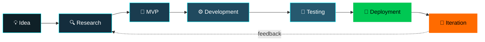

  
  
  

---

## 🧠 About Me

I'm an **AI & Data Science engineer and full‑stack developer** who turns ideas into working, real‑world software — end to end.

<table>
<tr>
<td width="50%" valign="top">

**🎯 What drives me**
- 🤖 Artificial Intelligence & Machine Learning
- 📊 Data-driven decision systems
- ⚙️ Backend architecture & API design
- 🔌 System integration & automation
- 🚀 Startup-focused product building

</td>
<td width="50%" valign="top">

**⚡ How I work**
- Ship fast, learn faster
- Build for real users, not demos
- Architecture scales *after* value is proven
- Iterate relentlessly

</td>
</tr>
</table>

---

## 🏗️ My Build Pipeline

```mermaid
flowchart LR
    A[💡 Idea] --> B[🔍 Research]
    B --> C[🧪 MVP]
    C --> D[⚙️ Development]
    D --> E[🧷 Testing]
    E --> F[🚀 Deployment]
    F --> G[🔁 Iteration]
    G -.feedback.-> B

    style A fill:#0F2027,stroke:#00F7FF,color:#fff
    style B fill:#142d3d,stroke:#00F7FF,color:#fff
    style C fill:#1a3c4f,stroke:#00F7FF,color:#fff
    style D fill:#204a5f,stroke:#00F7FF,color:#fff
    style E fill:#26596f,stroke:#00F7FF,color:#fff
    style F fill:#00C853,stroke:#00C853,color:#000
    style G fill:#FF6B00,stroke:#FF6B00,color:#000
```

---

## 🚀 Featured Projects

<table width="100%">
<tr>
<td width="33%" valign="top">

### 🏥 E-Patient
**AI-assisted pre-consultation healthcare portal**
Aggregates doctors from multiple hospitals into one platform for patients, doctors & admins.

`Full-Stack` `Healthcare` `AI`

📦 `mav8stro/E-Patient`

</td>
<td width="33%" valign="top">

### ♻️ GreenCycle Nexus
**Smart waste management platform**
Digital solutions for recycling, sustainability & civic operations.

`Sustainability` `Full-Stack`

📦 `mav8stro/Greencycle-Nexus`

</td>
<td width="33%" valign="top">

### 🤝 Volunteer Nexus
**Volunteer coordination platform**
Manages activities, users & community workflows end-to-end.

`Web App` `Workflow`

📦 `mav8stro/Volunteer-Nexus`

</td>
</tr>
<tr>
<td width="33%" valign="top">

### ♻️ GreenCycle
**Collaborative sustainability build**
Experimenting with tech-driven waste management approaches.

`Collaboration` `Sustainability`

📦 `muhammedfahim438-ctrl/Greencycle`

</td>
<td width="33%" valign="top">

### 🆘 ZimoFirstAid
**Emergency assistance platform**
Fast, accessible first-aid & safety information.

`Accessibility` `Community Tech`

📦 `mav8stro/zimofirstaid`

</td>
<td width="33%" valign="top">

### 🧠 ClassQuiz Live
**Real-time interactive quiz platform**
Live classroom engagement & learning activities.

`EdTech` `Real-Time`

📦 `mav8stro/classquiz-live`

</td>
</tr>
</table>

---

## 🛠️ Tech Stack

**AI & Data Science**
 

**Frontend**
 

**Backend**
 

**Database & Infra**
 

---

## 📈 Developer Philosophy

| Principle | Approach |
|---|---|
| ⚡ **Build** | Turn ideas into working products fast |
| 🧠 **Learn** | Improve through real experimentation |
| 🏗️ **Engineer** | Think in systems, not just features |
| 🔍 **Test** | Validate before scaling anything |
| 🚀 **Iterate** | Never stop improving |
| 🌍 **Impact** | Solve problems that actually matter |

---

## 📊 GitHub Activity

---

## 🌐 Connect With Me

