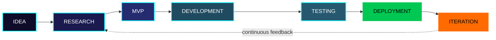
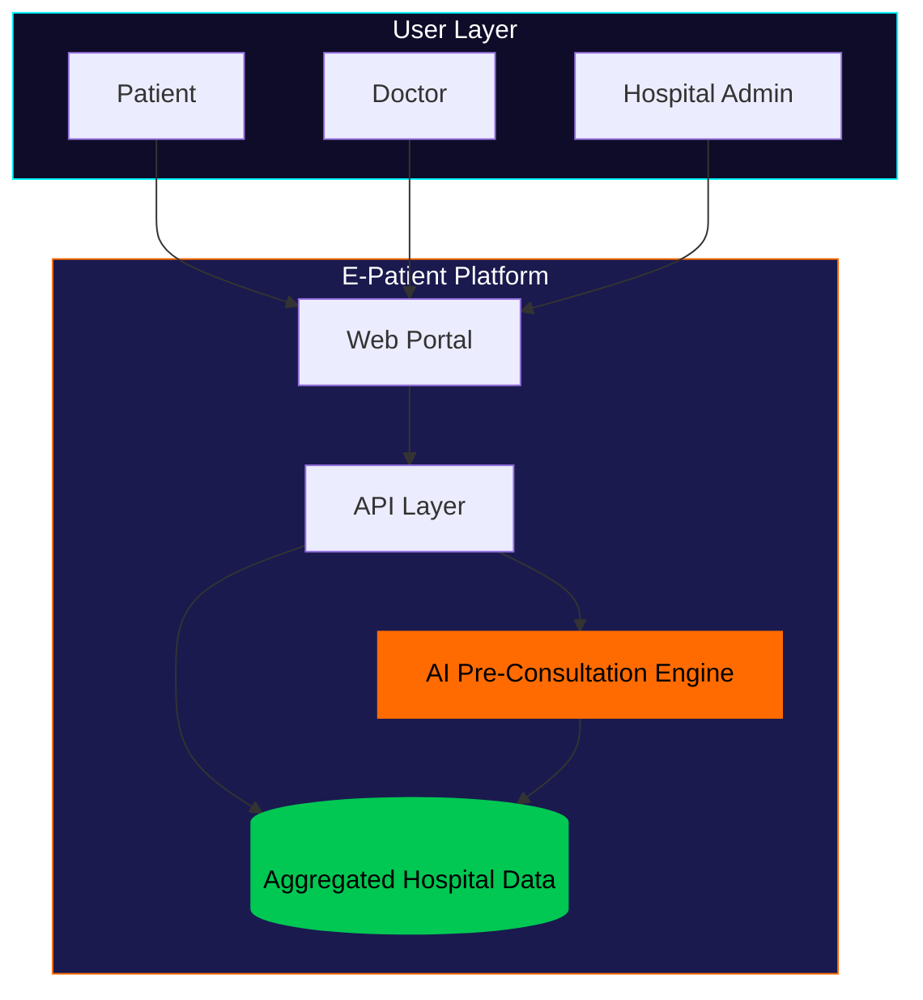
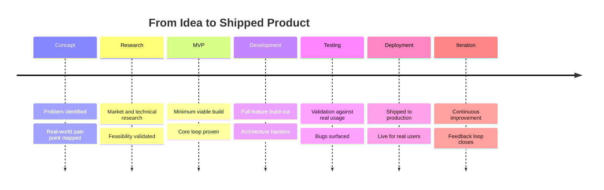

<div align="center">


<br/>

<p>
  
  
  
</p>

<p>
  
  
</p>

<!--
  SNAKE ANIMATION — this only works after a one-time setup:
  1. Create a repo named exactly "mav8stro" (your GitHub username) if you don't have one — this is the special profile-README repo.
  2. Add .github/workflows/snake.yml to that repo with the contents in the "Setup Snippets" section below.
  3. Commit — GitHub Actions will run it, create an "output" branch, and generate the SVG at the URL below.
  Until that workflow has run at least once, this image will show as broken.
-->


</div>

<br/>

## 🧬 Who I Am

> *"I build software the way an engineer thinks and a founder ships — fast, honest about trade-offs, and always pointed at a real user."*

I'm an **AI & Data Science engineer and full-stack developer** who takes products from a blank page to a running system in production. My work sits at the intersection of intelligent systems and pragmatic engineering — I don't just prototype AI ideas, I ship them as usable software with real backends, real databases, and real people using them.

<table width="100%">
<tr>
<td width="50%" valign="top">

### 🎯 What Drives Me
- 🤖 Practical, deployable Artificial Intelligence
- 📊 Data systems that actually inform decisions
- ⚙️ Backend architecture that survives contact with users
- 🔌 Clean API design & system integration
- 🚀 Startup-speed product execution
- 🧠 Automation that removes real friction

</td>
<td width="50%" valign="top">

### ⚡ How I Operate
- Ship the smallest working version first
- Validate with real usage before scaling
- Architecture follows proven value, not hype
- Iterate in tight, honest feedback loops
- Own a project end-to-end — concept to deploy

</td>
</tr>
</table>

<br/>

## 🏗️ My Build Pipeline

<div align="center">


```mermaid
flowchart LR
    A[IDEA] --> B[RESEARCH]
    B --> C[MVP]
    C --> D[DEVELOPMENT]
    D --> E[TESTING]
    E --> F[DEPLOYMENT]
    F --> G[ITERATION]
    G -.continuous feedback.-> B

    style A fill:#0F0C29,stroke:#00F7FF,stroke-width:2px,color:#fff
    style B fill:#1a1a4f,stroke:#00F7FF,stroke-width:2px,color:#fff
    style C fill:#242b6f,stroke:#00F7FF,stroke-width:2px,color:#fff
    style D fill:#204a5f,stroke:#00F7FF,stroke-width:2px,color:#fff
    style E fill:#26596f,stroke:#00F7FF,stroke-width:2px,color:#fff
    style F fill:#00C853,stroke:#00C853,stroke-width:2px,color:#000
    style G fill:#FF6B00,stroke:#FF6B00,stroke-width:2px,color:#000
```

</div>

Every project I ship moves through this loop — nothing skips straight to "scale." An idea earns its architecture by first proving it solves something real.

<br/>

## 🧭 System Thinking: How E-Patient Is Structured

<div align="center">


```mermaid
flowchart TB
    subgraph UserLayer[User Layer]
        PAT[Patient]
        DOC[Doctor]
        ADM[Hospital Admin]
    end

    subgraph CoreLayer[E-Patient Platform]
        UI[Web Portal]
        API[API Layer]
        AIENGINE[AI Pre-Consultation Engine]
        DB[(Aggregated Hospital Data)]
    end

    PAT --> UI
    DOC --> UI
    ADM --> UI
    UI --> API
    API --> AIENGINE
    API --> DB
    AIENGINE --> DB

    style UserLayer fill:#0F0C29,stroke:#00F7FF,color:#fff
    style CoreLayer fill:#1a1a4f,stroke:#FF6B00,color:#fff
    style AIENGINE fill:#FF6B00,stroke:#FF6B00,color:#000
    style DB fill:#00C853,stroke:#00C853,color:#000
```

</div>

<br/>

## 🚀 Featured Projects

<table width="100%">
<tr>
<td width="33%" valign="top">

### 🏥 E-Patient
**AI-assisted pre-consultation healthcare portal**

Aggregates doctors from multiple hospitals into a single portal serving three user types — patients, doctors, and hospital administrators — with AI handling pre-consultation intake.

`Full-Stack` `Healthcare` `AI`

📦 `mav8stro/E-Patient`

</td>
<td width="33%" valign="top">

### ♻️ GreenCycle Nexus
**Smart waste management platform**

Digital-first approach to recycling, sustainable operations, and civic waste workflows, built as a data-driven full-stack system.

`Sustainability` `Full-Stack` `Civic Tech`

📦 `mav8stro/Greencycle-Nexus`

</td>
<td width="33%" valign="top">

### 🤝 Volunteer Nexus
**Volunteer coordination platform**

Organizes volunteers, coordinates activities, and manages community workflows through structured user and activity management.

`Web App` `Workflow` `Community`

📦 `mav8stro/Volunteer-Nexus`

</td>
</tr>
<tr>
<td width="33%" valign="top">

### ♻️ GreenCycle
**Collaborative sustainability build**

A collaborative exploration of tech-driven approaches to waste management, built alongside another developer as a shared learning project.

`Collaboration` `Sustainability`

📦 `muhammedfahim438-ctrl/Greencycle`

</td>
<td width="33%" valign="top">

### 🆘 ZimoFirstAid
**Emergency assistance platform**

Puts first-aid awareness and emergency information within fast, accessible reach — built for moments where speed of access matters most.

`Accessibility` `Community Tech`

📦 `mav8stro/zimofirstaid`

</td>
<td width="33%" valign="top">

### 🧠 ClassQuiz Live
**Real-time interactive quiz platform**

Drives classroom engagement through live quizzes and real-time interaction, built for responsive, low-latency use in a live setting.

`EdTech` `Real-Time` `Web App`

📦 `mav8stro/classquiz-live`

</td>
</tr>
</table>

<br/>

## 🛠️ Tech Stack & Proficiency

<div align="center">

**🤖 AI & Data Science**
<br/>


`Python` `Machine Learning` `Data Science` `Pandas` `NumPy` `Artificial Intelligence`

<br/><br/>

**💻 Frontend**
<br/>


`React.js` `Vite` `JavaScript` `HTML5` `CSS3`

<br/><br/>

**⚙️ Backend**
<br/>


`Python` `Node.js` `Django` `Flask` `REST APIs` `Backend Architecture`

<br/><br/>

**🗄️ Database & Infrastructure**
<br/>


`MySQL` `PostgreSQL` `Docker` `Linux` `Git` `GitHub`

</div>

<br/>

## 🗺️ Development Journey


```mermaid
timeline
    title From Idea to Shipped Product
    Concept : Problem identified : Real-world pain point mapped
    Research : Market and technical research : Feasibility validated
    MVP : Minimum viable build : Core loop proven
    Development : Full feature build-out : Architecture hardens
    Testing : Validation against real usage : Bugs surfaced
    Deployment : Shipped to production : Live for real users
    Iteration : Continuous improvement : Feedback loop closes
```

<br/>

## 📈 Developer Philosophy

| Principle | Approach | Why It Matters |
|---|---|---|
| ⚡ **Build** | Turn ideas into working products fast | Speed reveals what actually matters |
| 🧠 **Learn** | Improve through real experimentation | Theory only goes so far |
| 🏗️ **Engineer** | Think in systems, not just features | Features rot; systems scale |
| 🔍 **Test** | Validate before scaling anything | Scaling the wrong thing is expensive |
| 🚀 **Iterate** | Never stop improving | Version 1 is a hypothesis, not a finish line |
| 🌍 **Impact** | Solve problems that actually matter | Impact is the only metric that compounds |

<br/>

## 📊 GitHub Activity

<div align="center">


<br/>


</div>

<br/>

## 🌐 Connect With Me

<p align="center">
<a href="https://github.com/mav8stro"></a>&nbsp;&nbsp;
<a href="https://www.linkedin.com/in/muhammed-salman-n-337400364"></a>&nbsp;&nbsp;
<a href="https://dev.to/mav8stro"></a>&nbsp;&nbsp;
<a href="https://instagram.com/sal_mx.x_"></a>
</p>

<div align="center">


</div>

---

## ⚙️ Setup Snippets (do this once for the snake animation to work)

Create `.github/workflows/snake.yml` in your **`mav8stro/mav8stro`** repo with:

```yaml
name: Generate Snake

on:
  schedule:
    - cron: "0 0 * * *"
  workflow_dispatch:
  push:
    branches: [ main ]

jobs:
  build:
    runs-on: ubuntu-latest
    steps:
      - uses: actions/checkout@v4
      - uses: Platane/snk@v3
        with:
          github_user_name: mav8stro
          outputs: dist/github-contribution-grid-snake-dark.svg?palette=github-dark
      - uses: crazy-max/ghaction-github-pages@v4
        with:
          target_branch: output
          build_dir: dist
        env:
          GITHUB_TOKEN: ${{ secrets.GITHUB_TOKEN }}
```

Push it once, let the Action run, and the snake image in this README will start rendering from your real contribution graph instead of showing broken.
