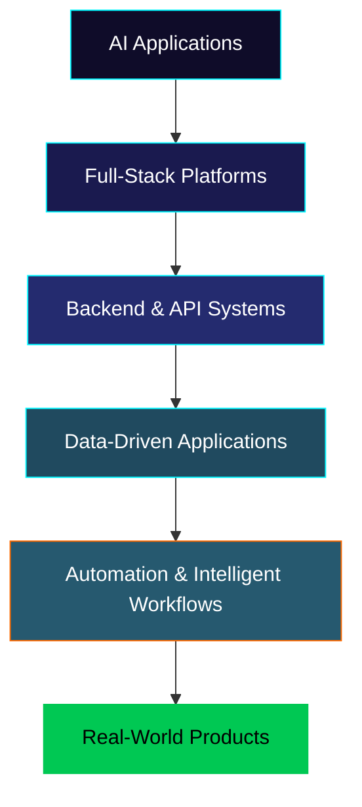
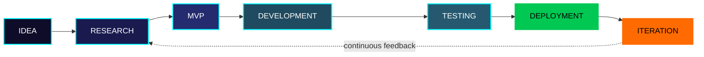
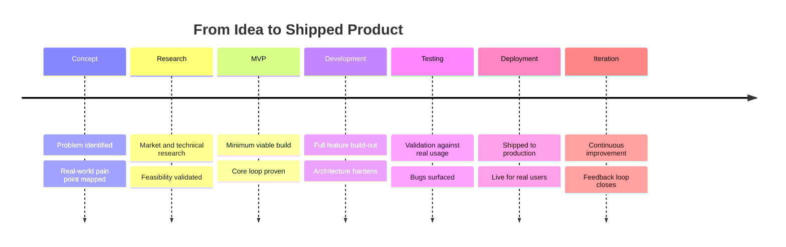
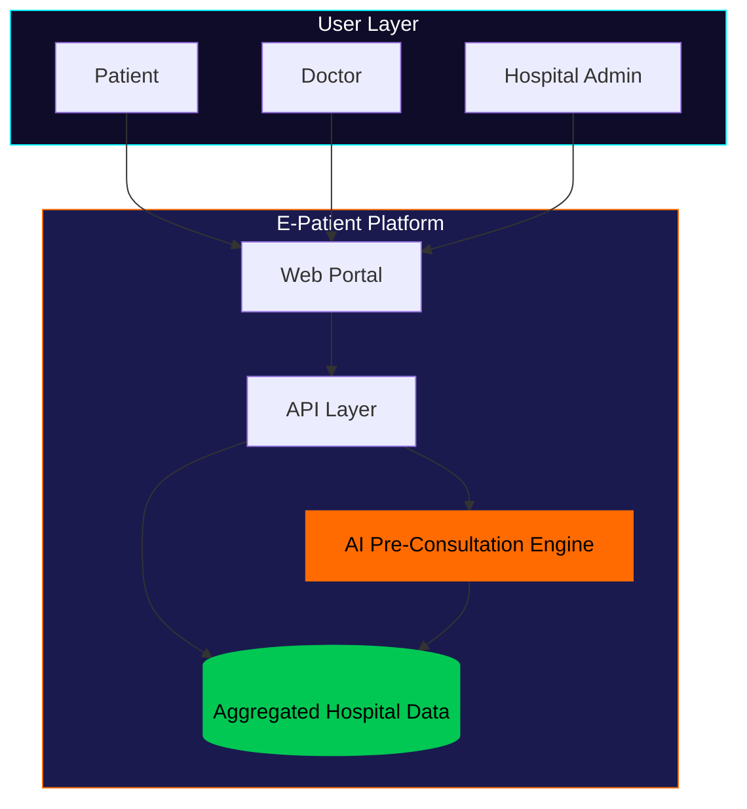
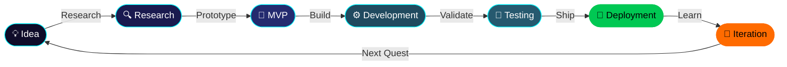

<div align="center">


<p>
  
  
  
  
</p>

<p>
  
  
  
</p>

<!-- SNAKE ANIMATION — requires one-time GitHub Actions setup, see the Setup Lab chapter below -->


</div>

<br/>

## 📖 Table of Contents — Pick Your Chapter

- [🌱 Chapter 1 — The Origin](#-chapter-1--the-origin)
- [🧬 Chapter 2 — Who I Am Today](#-chapter-2--who-i-am-today)
- [🗺️ Chapter 3 — The Build Pipeline](#️-chapter-3--the-build-pipeline)
- [🧭 Chapter 4 — Inside E-Patient](#-chapter-4--inside-e-patient-the-flagship-quest)
- [🎮 Chapter 5 — Skill Tree](#-chapter-5--skill-tree)
- [🚀 Chapter 6 — The Project Vault](#-chapter-6--the-project-vault)
- [🏆 Chapter 7 — Quest Log & Philosophy](#-chapter-7--quest-log--philosophy)
- [🎲 Chapter 8 — Fun & Games Arcade](#-chapter-8--fun--games-arcade)
- [📊 Chapter 9 — Stats & Leaderboards](#-chapter-9--stats--leaderboards)
- [🛠️ Chapter 10 — The Setup Lab](#️-chapter-10--the-setup-lab-optional-upgrades)
- [🌐 Chapter 11 — Connect & Continue](#-chapter-11--connect--continue)

---

## 🌱 Chapter 1 — The Origin

```text
> INITIALIZING DEVELOPER PROFILE...
> LOADING: mav8stro
> CLASS: AI & Data Science Engineer / Full-Stack Developer
> ALIGNMENT: Ship Real Things
> QUEST GIVER: Curiosity
> STATUS: In Progress...
```

Every builder starts with a question mark. Mine turned into a pattern I keep repeating: **see a real problem → learn what's needed to solve it → build something people can actually use.**

That loop has taken me from experimenting with AI and data pipelines to designing full systems — frontend, backend, and the intelligence layer that ties them together. I'm not chasing frameworks for their own sake; I'm chasing **finished, working, deployed products**.

> *[Optional: drop in your own founding story here — the moment you first wrote code, the first bug that hooked you, or the problem that made you want to build E-Patient. This is your chapter to fill in.]*

<br/>

## 🧬 Chapter 2 — Who I Am Today

<div align="center">

| | |
|---|---|
| 🧠 **Class** | AI & Data Science Engineer |
| 💻 **Secondary Class** | Full-Stack Developer |
| ⚙️ **Specialization** | Backend Architecture & API Systems |
| 🚀 **Guild** | Startup Builder |
| 🎯 **Current Quest** | Building **E-Patient** |
| 🌍 **Playstyle** | Idea → MVP → Ship → Iterate |

</div>

I'm an **AI & Data Science engineer and full-stack developer** focused on building practical software products that solve real-world problems. My interests sit at the intersection of:

<table width="100%">
<tr>
<td width="50%" valign="top">

### 🎯 What Drives Me
- 🤖 Artificial Intelligence that ships, not just demos
- 📊 Data Science that actually informs decisions
- 💻 Full-Stack Development across the whole product
- ⚙️ Backend Engineering that holds up under real load
- 🔌 API & System Integration done cleanly
- 🚀 Startup & Product Development at real speed
- 🧠 Intelligent Automation that removes real friction

</td>
<td width="50%" valign="top">

### ⚡ How I Operate
- Ship the smallest working version first
- Validate with real usage before scaling
- Let architecture follow proven value, not hype
- Iterate in tight, honest feedback loops
- Own a project end-to-end — concept to deploy
- Treat testing as a step, not an afterthought

</td>
</tr>
</table>

### 🏗️ What I Build


```mermaid
flowchart TB
    A[AI Applications] --> B[Full-Stack Platforms]
    B --> C[Backend & API Systems]
    C --> D[Data-Driven Applications]
    D --> E[Automation & Intelligent Workflows]
    E --> F[Real-World Products]

    style A fill:#0F0C29,stroke:#00F7FF,color:#fff
    style B fill:#1a1a4f,stroke:#00F7FF,color:#fff
    style C fill:#242b6f,stroke:#00F7FF,color:#fff
    style D fill:#204a5f,stroke:#00F7FF,color:#fff
    style E fill:#26596f,stroke:#FF6B00,color:#fff
    style F fill:#00C853,stroke:#00C853,color:#000
```

<br/>

## 🗺️ Chapter 3 — The Build Pipeline

Every product I ship walks the same road. Nothing skips straight to "scale" — an idea has to earn its architecture by first proving it solves something real.


```mermaid
flowchart LR
    A[IDEA] --> B[RESEARCH]
    B --> C[MVP]
    C --> D[DEVELOPMENT]
    D --> E[TESTING]
    E --> F[DEPLOYMENT]
    F --> G[ITERATION]
    G -.continuous feedback.-> B

    style A fill:#0F0C29,stroke:#00F7FF,stroke-width:2px,color:#fff
    style B fill:#1a1a4f,stroke:#00F7FF,stroke-width:2px,color:#fff
    style C fill:#242b6f,stroke:#00F7FF,stroke-width:2px,color:#fff
    style D fill:#204a5f,stroke:#00F7FF,stroke-width:2px,color:#fff
    style E fill:#26596f,stroke:#00F7FF,stroke-width:2px,color:#fff
    style F fill:#00C853,stroke:#00C853,stroke-width:2px,color:#000
    style G fill:#FF6B00,stroke:#FF6B00,stroke-width:2px,color:#000
```


```mermaid
timeline
    title From Idea to Shipped Product
    Concept : Problem identified : Real-world pain point mapped
    Research : Market and technical research : Feasibility validated
    MVP : Minimum viable build : Core loop proven
    Development : Full feature build-out : Architecture hardens
    Testing : Validation against real usage : Bugs surfaced
    Deployment : Shipped to production : Live for real users
    Iteration : Continuous improvement : Feedback loop closes
```

<br/>

## 🧭 Chapter 4 — Inside E-Patient, The Flagship Quest

**E-Patient** is an **AI-assisted pre-consultation healthcare web portal** that aggregates doctors from multiple hospitals into a single platform — built to serve **patients, doctors, and hospital administrators** all at once.


```mermaid
flowchart TB
    subgraph UserLayer[User Layer]
        PAT[Patient]
        DOC[Doctor]
        ADM[Hospital Admin]
    end

    subgraph CoreLayer[E-Patient Platform]
        UI[Web Portal]
        API[API Layer]
        AIENGINE[AI Pre-Consultation Engine]
        DB[(Aggregated Hospital Data)]
    end

    PAT --> UI
    DOC --> UI
    ADM --> UI
    UI --> API
    API --> AIENGINE
    API --> DB
    AIENGINE --> DB

    style UserLayer fill:#0F0C29,stroke:#00F7FF,color:#fff
    style CoreLayer fill:#1a1a4f,stroke:#FF6B00,color:#fff
    style AIENGINE fill:#FF6B00,stroke:#FF6B00,color:#000
    style DB fill:#00C853,stroke:#00C853,color:#000
```

**🎥 Demo:** *[Add a screen-recording GIF or a link to a live/video walkthrough of E-Patient here — GitHub READMEs don't autoplay video, so a short GIF thumbnail linking out works best.]*

**Why it matters:** healthcare access is fragmented across hospitals with their own separate systems. E-Patient's bet is that a single AI-assisted portal — one that pre-screens and routes patients intelligently before they ever sit down with a doctor — makes the whole system faster for everyone touching it.

<br/>

## 🎮 Chapter 5 — Skill Tree

<div align="center">

**🤖 AI & Data Science**
<br/>

<br/>
`Python` `Machine Learning` `Data Science` `Artificial Intelligence` `Pandas` `NumPy`

<br/><br/>

**💻 Frontend**
<br/>

<br/>
`React.js` `Vite` `JavaScript` `HTML5` `CSS3`

<br/><br/>

**⚙️ Backend**
<br/>

<br/>
`Python` `Node.js` `Django` `Flask` `REST APIs` `Backend Architecture`

<br/><br/>

**🗄️ Database & Infrastructure**
<br/>

<br/>
`MySQL` `PostgreSQL` `Docker` `Linux` `Git` `GitHub`

</div>

### 🧗 Comfort Level (self-rated, not a benchmark)

```text
Python            ▓▓▓▓▓▓▓▓▓░  90%
Full-Stack Dev    ▓▓▓▓▓▓▓▓░░  80%
Backend / APIs    ▓▓▓▓▓▓▓▓░░  80%
Machine Learning  ▓▓▓▓▓▓▓░░░  70%
Databases         ▓▓▓▓▓▓▓░░░  70%
DevOps / Docker   ▓▓▓▓▓▓░░░░  60%
```
*(These are self-assessed comfort levels for flavor, not a certified metric — adjust the bars to match how you'd honestly rate yourself.)*

<br/>

## 🚀 Chapter 6 — The Project Vault

<table width="100%">
<tr>
<td width="50%" valign="top">

### 🏥 E-Patient
**AI-assisted pre-consultation healthcare portal**

Aggregates doctors from multiple hospitals into one portal serving patients, doctors, and hospital administrators, with AI handling pre-consultation intake and routing.

`Full-Stack` `Healthcare` `AI`
📦 `mav8stro/E-Patient`

</td>
<td width="50%" valign="top">

### ♻️ GreenCycle Nexus
**Smart waste management platform**

A digital-first approach to waste management, recycling, and sustainable operations — built as a data-driven full-stack civic-tech system.

`Sustainability` `Full-Stack` `Civic Tech`
📦 `mav8stro/Greencycle-Nexus`

</td>
</tr>
<tr>
<td width="50%" valign="top">

### 🤝 Volunteer Nexus
**Volunteer management platform**

Organizes volunteers, coordinates activities, and manages community-oriented workflows through structured user and activity management.

`Web App` `Workflow` `Community`
📦 `mav8stro/Volunteer-Nexus`

</td>
<td width="50%" valign="top">

### ♻️ GreenCycle
**Collaborative sustainability project**

A collaborative exploration of tech-driven approaches to waste management and sustainability, built alongside another developer.

`Collaboration` `Sustainability`
📦 `muhammedfahim438-ctrl/Greencycle`

</td>
</tr>
<tr>
<td width="50%" valign="top">

### 🆘 ZimoFirstAid
**First-aid & emergency assistance platform**

Puts first-aid awareness, emergency assistance, and accessible safety information within fast, reliable reach.

`Accessibility` `Community Tech` `Emergency`
📦 `mav8stro/zimofirstaid`

</td>
<td width="50%" valign="top">

### 🧠 ClassQuiz Live
**Interactive quiz & learning platform**

An EdTech environment for quizzes, classroom engagement, and real-time learning activities.

`EdTech` `Real-Time` `Web App`
📦 `mav8stro/classquiz-live`

</td>
</tr>
</table>

<br/>

## 🏆 Chapter 7 — Quest Log & Philosophy


```mermaid
flowchart LR
    IDEA(["💡 Idea"]) -->|Research| RES(["🔍 Research"])
    RES -->|Prototype| MVP(["🧪 MVP"])
    MVP -->|Build| DEV(["⚙️ Development"])
    DEV -->|Validate| TEST(["🧷 Testing"])
    TEST -->|Ship| DEPLOY(["🚀 Deployment"])
    DEPLOY -->|Learn| ITER(["🔁 Iteration"])
    ITER -->|Next Quest| IDEA

    style IDEA fill:#0F0C29,stroke:#00F7FF,color:#fff
    style RES fill:#1a1a4f,stroke:#00F7FF,color:#fff
    style MVP fill:#242b6f,stroke:#00F7FF,color:#fff
    style DEV fill:#204a5f,stroke:#00F7FF,color:#fff
    style TEST fill:#26596f,stroke:#00F7FF,color:#fff
    style DEPLOY fill:#00C853,stroke:#00C853,color:#000
    style ITER fill:#FF6B00,stroke:#FF6B00,color:#000
```

| Principle | Approach | Why It Matters |
|---|---|---|
| ⚡ **Build** | Turn ideas into working products fast | Speed reveals what actually matters |
| 🧠 **Learn** | Improve through real experimentation | Theory only goes so far |
| 🏗️ **Engineer** | Think in systems, not just features | Features rot; systems scale |
| 🔍 **Test** | Validate before scaling anything | Scaling the wrong thing is expensive |
| 🚀 **Iterate** | Never stop improving | Version 1 is a hypothesis, not a finish line |
| 🌍 **Impact** | Solve problems that actually matter | Impact is the only metric that compounds |
| 🤝 **Collaborate** | Build alongside others when it helps | Some quests are better as a party |
| 🔬 **Question** | Doubt the easy answer | The obvious fix often hides the real one |

<br/>

## 🎲 Chapter 8 — Fun & Games Arcade

A few playful, live-updating widgets — because a dev profile can still have a pulse.

<div align="center">

<!-- Random dev joke, refreshes on every README view -->


<br/><br/>

<!-- Rotating inspirational/dev quote -->


<br/><br/>


</div>

**🕹️ Bonus round:** the snake game up top eats your real contribution graph once the Action in Chapter 10 is wired up — that's your actual daily commits turned into a playable-looking creature.

> *[Fun idea to add later: link a small game you've built (even a simple browser game) here as a "play a project I made" easter egg for visitors.]*

<br/>

## 📊 Chapter 9 — Stats & Leaderboards

<div align="center">


<br/>


<br/>


</div>

<sub>⚠️ Some stat widgets (trophy, activity graph) are hosted on free community servers and occasionally load slowly or time out — that's the service, not a broken link. Refresh if one doesn't appear.</sub>

<br/>

## 🛠️ Chapter 10 — The Setup Lab (optional upgrades)

These aren't plug-and-play — each needs a small one-time setup on your side. Listed here so you know exactly what's live vs. what needs activation.

<details>
<summary><b>🐍 Snake contribution animation</b> — needs a GitHub Action in your profile repo</summary>

Create `.github/workflows/snake.yml` in your **`mav8stro/mav8stro`** repo:

```yaml
name: Generate Snake
on:
  schedule:
    - cron: "0 0 * * *"
  workflow_dispatch:
  push:
    branches: [ main ]
jobs:
  build:
    runs-on: ubuntu-latest
    steps:
      - uses: actions/checkout@v4
      - uses: Platane/snk@v3
        with:
          github_user_name: mav8stro
          outputs: dist/github-contribution-grid-snake-dark.svg?palette=github-dark
      - uses: crazy-max/ghaction-github-pages@v4
        with:
          target_branch: output
          build_dir: dist
        env:
          GITHUB_TOKEN: ${{ secrets.GITHUB_TOKEN }}
```

</details>

<details>
<summary><b>🎧 Spotify "Now Playing" widget</b> — needs your own Spotify API auth</summary>

Use the community project `novatorem/spotify-github-profile` — follow its README to connect your Spotify account and get a personal widget URL, then drop the returned `` tag into Chapter 8.

</details>

<details>
<summary><b>⏱️ WakaTime coding-time stats</b> — needs a WakaTime account + API key</summary>

Install the WakaTime plugin for your editor, then embed:

```md

```

</details>

<details>
<summary><b>🧊 3D contribution calendar</b> — needs a GitHub Action, like the snake</summary>

Community project: `yoshi389111/github-profile-3d-contrib`. Its README includes a ready-made Action you can drop straight into this repo.

</details>

<br/>

## 🌐 Chapter 11 — Connect & Continue

<p align="center">
<a href="https://github.com/mav8stro"></a>&nbsp;&nbsp;
<a href="https://www.linkedin.com/in/muhammed-salman-n-337400364"></a>&nbsp;&nbsp;
<a href="https://dev.to/mav8stro"></a>&nbsp;&nbsp;
<a href="https://instagram.com/sal_mx.x_"></a>
</p>

<div align="center">

### 🚀 What's Next?

```text
Build better AI systems.
Create scalable products.
Solve meaningful problems.
Turn ideas into real businesses.
Keep learning. Keep shipping.
```


</div>
