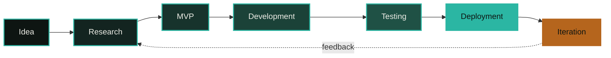
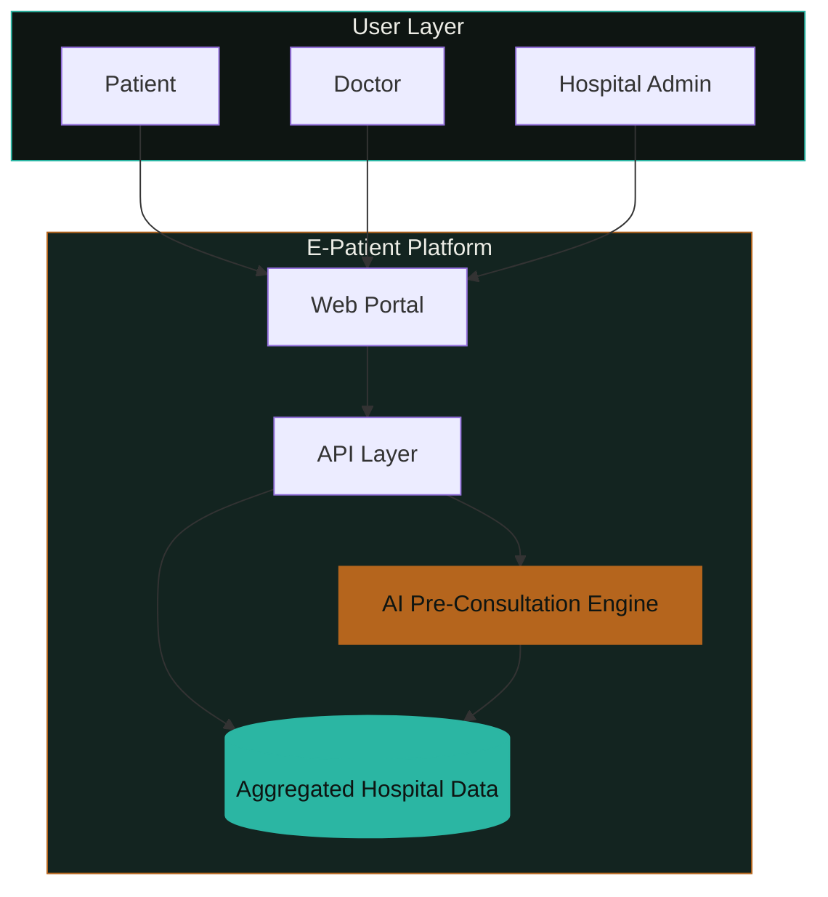

<!-- Native, self-animating SVG — this is real vector animation, not a hosted widget. Add pulse.svg to your repo root (or /assets) for this to render. -->

  
  
  

  
  

 

## Vitals

| | |
|---|---|
| **Role** | AI & Data Science Engineer · Full-Stack Developer |
| **Specialty** | Backend architecture, API design, applied AI |
| **Currently building** | E-Patient — an AI-assisted pre-consultation healthcare portal |
| **Method** | Idea → MVP → Ship → Iterate. Nothing scales before it's proven. |

I'm an AI & Data Science engineer and full-stack developer who takes products from a blank page to a running system in production. I don't just prototype AI ideas — I ship them as usable software, with real backends, real data, and real people using them.

 

## The Build Loop

Every project moves through the same loop. Nothing skips to "scale" — an idea earns its architecture by proving it solves something real first.

```mermaid
flowchart LR
    A[Idea] --> B[Research]
    B --> C[MVP]
    C --> D[Development]
    D --> E[Testing]
    E --> F[Deployment]
    F --> G[Iteration]
    G -.feedback.-> B

    style A fill:#0E1512,stroke:#2BB6A3,stroke-width:2px,color:#EDEDE6
    style B fill:#132420,stroke:#2BB6A3,stroke-width:2px,color:#EDEDE6
    style C fill:#17332C,stroke:#2BB6A3,stroke-width:2px,color:#EDEDE6
    style D fill:#1B4238,stroke:#2BB6A3,stroke-width:2px,color:#EDEDE6
    style E fill:#1F5145,stroke:#2BB6A3,stroke-width:2px,color:#EDEDE6
    style F fill:#2BB6A3,stroke:#2BB6A3,stroke-width:2px,color:#0E1512
    style G fill:#B5651D,stroke:#B5651D,stroke-width:2px,color:#0E1512
```

 

## Flagship — E-Patient

An **AI-assisted pre-consultation healthcare portal** that aggregates doctors from multiple hospitals into a single platform — built to serve patients, doctors, and hospital administrators at once.

```mermaid
flowchart TB
    subgraph Users[User Layer]
        PAT[Patient]
        DOC[Doctor]
        ADM[Hospital Admin]
    end

    subgraph Core[E-Patient Platform]
        UI[Web Portal]
        API[API Layer]
        AI[AI Pre-Consultation Engine]
        DB[(Aggregated Hospital Data)]
    end

    PAT --> UI
    DOC --> UI
    ADM --> UI
    UI --> API
    API --> AI
    API --> DB
    AI --> DB

    style Users fill:#0E1512,stroke:#2BB6A3,color:#EDEDE6
    style Core fill:#132420,stroke:#B5651D,color:#EDEDE6
    style AI fill:#B5651D,stroke:#B5651D,color:#0E1512
    style DB fill:#2BB6A3,stroke:#2BB6A3,color:#0E1512
```

One portal, three user types, one AI layer handling pre-consultation intake — so hospitals stop making patients repeat themselves across systems.

 

## Also Shipping

| Project | What it does | Stack |
|---|---|---|
| **GreenCycle Nexus** | Smart waste management platform — digital workflows for recycling and sustainable operations | `Full-Stack` `Civic Tech` |
| **Volunteer Nexus** | Coordinates volunteers, activities, and community workflows in one place | `Web App` `Workflow` |
| **GreenCycle** | Collaborative build exploring tech-driven approaches to waste management | `Collaboration` |
| **ZimoFirstAid** | Fast, accessible first-aid and emergency assistance information | `Accessibility` |
| **ClassQuiz Live** | Real-time interactive quizzes for classroom engagement | `EdTech` `Real-Time` |

 

## Stack

| | |
|---|---|
| **AI / Data** | Python · Machine Learning · Pandas · NumPy |
| **Frontend** | React · Vite · JavaScript · HTML5 · CSS3 |
| **Backend** | Python · Node.js · Django · Flask · REST APIs |
| **Data / Infra** | MySQL · PostgreSQL · Docker · Linux · Git |

 

## Activity

These pull live from the GitHub API — nothing hardcoded, so they always reflect your real repos.

 

## Connect

<a href="https://github.com/mav8stro">GitHub</a> ·
<a href="https://www.linkedin.com/in/muhammed-salman-n-337400364">LinkedIn</a> ·
<a href="https://dev.to/mav8stro">dev.to</a> ·
<a href="https://instagram.com/sal_mx.x_">Instagram</a>

---

### One-time setup

The pulse line at the top is a real `.svg` file, not a hosted widget — commit `pulse.svg` to your repo root (or update the `src` path if you place it elsewhere) and it will animate natively once GitHub serves it.
